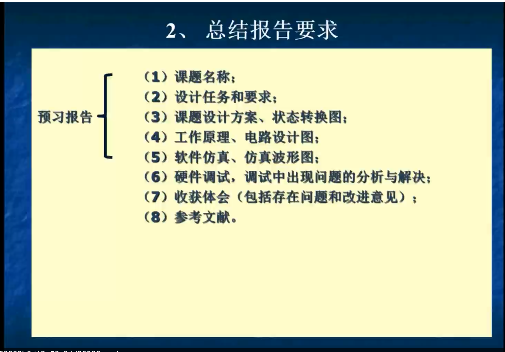
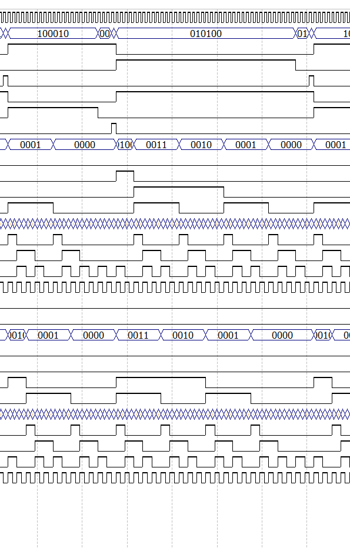

# 电子课程设计--交通灯

> https://github.com/AmorFati-coder/traffic-vhdl

## 设计任务及要求




## 设计方案

以有限状态机为设计基础，通过对系统状态和转移关系的定义，运用VHDL语言完成红绿灯设计

- 状态转换图


- 方案设计

  选用模式3

  

  ```vhdl
  ENTITY traffic IS
  	PORT(CLK,RST,SWI: IN STD_LOGIC;
  		LED: OUT STD_LOGIC_VECTOR(5 DOWNTO  0);	--红绿灯
  		WideSEGH: OUT STD_LOGIC_VECTOR(3 DOWNTO  0); --东西方向数码管高位
  		WideSEGL: OUT STD_LOGIC_VECTOR(3 DOWNTO  0); --东西方向数码管低位
  		NSEGH: OUT STD_LOGIC_VECTOR(3 DOWNTO  0); --南北方向数码管高位
  		NSEGL: OUT STD_LOGIC_VECTOR(3 DOWNTO  0)); --南北方向数码管低位
  END ENTITY traffic;
  ```
  
  - 数码管由译码器输出，输入4位二进制数，选用$PIO19-PIO16$作为东西方向的低位，$PIO23-PIO20$作为东西方向的高位，$PIO27-PIO24$作为南北方向的低位，$PIO31-PIO28$作为南北方向的高位。
  
  - 红绿灯，选用$PIO13-PIO8$输出
  
  - 复位，初始化$S0$状态，重新开始计数
  
    ```vhdl
    REG: PROCESS (RST,CLK)
    	BEGIN
    		IF RST= '1' THEN   
    			current_s <= s0;      
    		ELSIF clk='1' AND clk'EVENT THEN   
    			current_s <= next_s; 
    		END IF;s
    	END PROCESS
    ```
  
  - 计数器
  
    ```vhdl
    COUNT: PROCESS(RST,CLK)
    		BEGIN
    			IF RST= '1' THEN --异步清零
    				COUNT68<="00000000";
    			ELSIF CLK'EVENT AND CLK='1' THEN
    				IF COUNT68<"01000011" THEN 
    					COUNT68<=COUNT68+1;
    				ELSE 
    					COUNT68<="00000000"; 
    				END IF;
    			END IF;
    		END PROCESS;
    ```
  
  - 译码器
  
    > 将倒计时转换为十进制
  
    ```vhdl
    IF WESEG>39 THEN 
    		WESEG:=WESEG+24;
    	ELSIF WESEG>29 THEN 
    		WESEG:=WESEG+18;
    	ELSIF WESEG>19 THEN
    		WESEG:=WESEG+12;
    	ELSIF WESEG>9 THEN
    		WESEG:=WESEG+6;
    	ELSE NULL;
    	END IF;
    	
    	
    	IF NSSEG>39 THEN
    		NSSEG:=NSSEG+24;
    	ELSIF NSSEG>29 THEN 
    		NSSEG:=NSSEG+18;
    	ELSIF NSSEG>19 THEN 
    		NSSEG:=NSSEG+12;
    	ELSIF NSSEG>9 THEN 
    		NSSEG:=NSSEG+6;
    	ELSE NULL;
    	END IF;
    	WideSEGH<=WESEG(7 DOWNTO 4);
    	WideSEGL<=WESEG(3 DOWNTO 0);
    	NSEGH<=NSSEG(7 DOWNTO 4);
    	NSEGL<=NSSEG(3 DOWNTO 0);
    ```
  
  - 状态转换
  
    ```vhdl
    CASE current_s IS                     
    	WHEN s0 => LED<= "010100";
    		WESEG:=39-COUNT68;
    		NSSEG:=43-COUNT68; 
    		IF COUNT68 ="00100111" THEN
    			next_s<=s1;                    
    		ELSE 
    			next_s<=s0;    
    		END IF;
    	WHEN s1 => LED <= "001100";
    		WESEG:=43-COUNT68;
    		NSSEG:=43-COUNT68; 
    		IF COUNT68 = "00101011" THEN  --B00101011=43
    			next_s<=s2;    
    		ELSE
    			LED<="000100";
    			next_s<=s1;   
    		END IF;
    	WHEN s2 => LED <= "100010";
    		WESEG:=67-COUNT68;
    		NSSEG:=63-COUNT68; 
    		IF COUNT68 ="00111111" THEN  --B00111111=64
    			next_s <= s3;
    		ELSE  
    			next_s <= s2; 
    		END IF;
    	WHEN s3 => LED <= "100001";
    		WESEG:=67-COUNT68;
    		NSSEG:=67-COUNT68; 
    		IF COUNT68 ="01000011" THEN --B01000011=67 
    			next_s<= s0; 
    		ELSE
    			LED<="100000";
    			next_s <= s3;   
    		END IF;
    	WHEN OTHERS=> LED <="100100"; 
    END case;
    ```

## 软件仿真


```vhdl
library IEEE;--库文件
USE IEEE.std_logic_1164.all;
USE IEEE.STD_LOGIC_UNSIGNED.all;

ENTITY traffic IS
	PORT(CLK,RST,SWI: IN STD_LOGIC;
		LED: OUT STD_LOGIC_VECTOR(5 DOWNTO  0);	--红绿灯
		WideSEGH: OUT STD_LOGIC_VECTOR(3 DOWNTO  0); --东西方向数码管高位
		WideSEGL: OUT STD_LOGIC_VECTOR(3 DOWNTO  0); --东西方向数码管低位
		NSEGH: OUT STD_LOGIC_VECTOR(3 DOWNTO  0); --南北方向数码管高位
		NSEGL: OUT STD_LOGIC_VECTOR(3 DOWNTO  0)); --南北方向数码管低位
END ENTITY traffic;


ARCHITECTURE bhv OF traffic IS
    TYPE state IS(S0,S1,S2,S3);
    SIGNAL current_s,next_s:state;
    SIGNAL COUNT68:STD_LOGIC_VECTOR(7 DOWNTO  0);
	 --SIGNAL grenn_time:integer:=39;
	 --SIGNAL red_time:integer:=43;
      BEGIN
COUNT: PROCESS(RST,CLK)
		BEGIN
			IF RST= '1' THEN
				COUNT68<="00000000";
			ELSIF CLK'EVENT AND CLK='1' THEN
				IF COUNT68<"01000011" THEN 
					COUNT68<=COUNT68+1;
				ELSE 
					COUNT68<="00000000"; 
				END IF;
			END IF;
		END PROCESS;


REG: PROCESS (RST,CLK)           
	BEGIN
		IF RST= '1' THEN   
			current_s <= s0;      
		ELSIF clk='1' AND clk'EVENT THEN   
			current_s <= next_s; 
		END IF;
	END PROCESS;     

COM:PROCESS(current_s, COUNT68, SWI, CLK)       
VARIABLE WESEG,NSSEG:STD_LOGIC_VECTOR(7 DOWNTO  0);
	BEGIN
	IF SWI='0' THEN 
		CASE current_s IS                     
			WHEN s0 => LED<= "010100";
				WESEG:=39-COUNT68;
				NSSEG:=43-COUNT68; 
				IF COUNT68 ="00100111" THEN
					next_s<=s1;                    
				ELSE 
					next_s<=s0;    
				END IF;
			WHEN s1 => LED <= "001100";
				WESEG:=43-COUNT68;
				NSSEG:=43-COUNT68; 
				IF COUNT68 = "00101011" THEN  --B00101011=43
					next_s<=s2;    
				ELSE
					LED<="000100";
					next_s<=s1;   
				END IF;
			WHEN s2 => LED <= "100010";
				WESEG:=67-COUNT68;
				NSSEG:=63-COUNT68; 
				IF COUNT68 ="00111111" THEN  --B00111111=64
					next_s <= s3;
				ELSE  
					next_s <= s2; 
				END IF;
			WHEN s3 => LED <= "100001";
				WESEG:=67-COUNT68;
				NSSEG:=67-COUNT68; 
				IF COUNT68 ="01000011" THEN --B01000011=67 
					next_s<= s0; 
				ELSE
					LED<="100000";
					next_s <= s3;   
				END IF;
			WHEN OTHERS=> LED <="100100"; 
    END case;
	 
	
	IF WESEG>39 THEN 
		WESEG:=WESEG+24;
	ELSIF WESEG>29 THEN 
		WESEG:=WESEG+18;
	ELSIF WESEG>19 THEN
		WESEG:=WESEG+12;
	ELSIF WESEG>9 THEN
		WESEG:=WESEG+6;
	ELSE NULL;
	END IF;
	
	
	IF NSSEG>39 THEN
		NSSEG:=NSSEG+24;
	ELSIF NSSEG>29 THEN 
		NSSEG:=NSSEG+18;
	ELSIF NSSEG>19 THEN 
		NSSEG:=NSSEG+12;
	ELSIF NSSEG>9 THEN 
		NSSEG:=NSSEG+6;
	ELSE NULL;
	END IF;
	WideSEGH<=WESEG(7 DOWNTO 4);
	WideSEGL<=WESEG(3 DOWNTO 0);
	NSEGH<=NSSEG(7 DOWNTO 4);
	NSEGL<=NSSEG(3 DOWNTO 0);
	
END IF;
END PROCESS;  
END ARCHITECTURE bhv;
```

## 仿真波形图

> LED[5]南北红灯，LED[4]南北绿灯，LED[3]南北黄灯，LED[2]东西红灯，LED[1]东西绿灯，LED[0]东西黄灯

- $RST='0' \quad AND \quad SWI='0'$

  $S0->S1$，

  | LED[5] | LED[4] | LED[3] | LED[2] | LED[1] | LED[0] |
  | ------ | ------ | ------ | ------ | ------ | ------ |
  | 0      | 1      | 0      | 1      | 0      | 0      |
  | 0      | 0      | 1      | 1      | 0      | 0      |

  $S1->S2$

  | LED[5] | LED[4] | LED[3] | LED[2] | LED[1] | LED[0] |
  | ------ | ------ | ------ | ------ | ------ | ------ |
  | 0      | 0      | 1      | 1      | 0      | 0      |
  | 1      | 0      | 0      | 0      | 1      | 0      |


​		$S2->S3$

| LED[5] | LED[4] | LED[3] | LED[2] | LED[1] | LED[0] |
| ------ | ------ | ------ | ------ | ------ | ------ |
| 1      | 0      | 0      | 0      | 1      | 0      |
| 1      | 0      | 0      | 0      | 0      | 1      |

最后$S3-S0$循环下去



- $RST='1'\quad SWI='0'$

  | LED[5] | LED[4] | LED[3] | LED[2] | LED[1] | LED[0] |
  | ------ | ------ | ------ | ------ | ------ | ------ |
  | 0      | 1      | 0      | 1      | 0      | 0      |

  一直是$S0$状态


- $RST='0'\quad SWI='1'$

  $SWI='1'时，状态转换停止，计数器停止计数$

  

## 调试中的问题

1. 模式选择的问题，一直在模式5下烧录对应模式3映射的管脚，导致一直没有结果
2. 没有像C/C++这些高级语言，在IDE里面经常用的断点获取变量的状态，变量只能通过波形仿真和硬件验证判断

## 收获

1. VHDL作为一种硬件描述语言，属于硬件层面的技术，和之前熟悉的编程语言大相径庭，更关注电路的逻辑。在语法上更加繁琐，严谨，希望以后在学习工作中不会再用:cry:
2. 有限状态机及其设计技术是数字系统中实现高效率、高可靠性逻辑控制的重要途径。通过对控制功能的分析和实际状态的选择，把交通灯的控制归纳为4种工作状态，并建立状态转移关系，较为准确、直观的反映了实际需求。

## 参考资料

[交通灯—VHDL设计](https://blog.csdn.net/qq_44705488/article/details/117944996)

[abhishekjiitr](https://github.com/abhishekjiitr)/[traffic-light-controller](https://github.com/abhishekjiitr/traffic-light-controller)

[VHDL实现交通灯程序](https://blog.csdn.net/qq_36243942/article/details/89441651)
